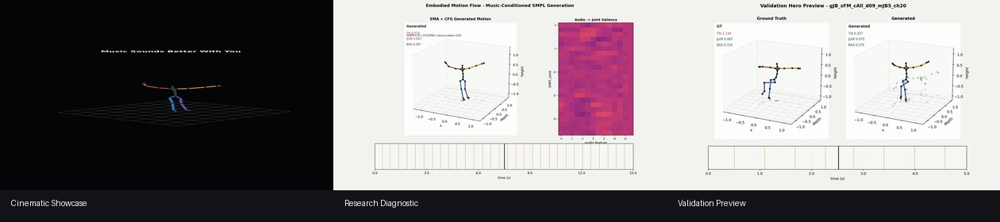
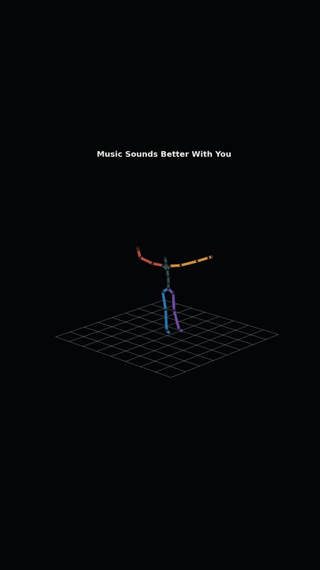
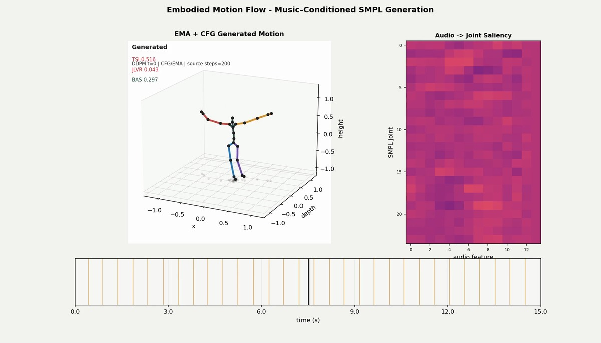
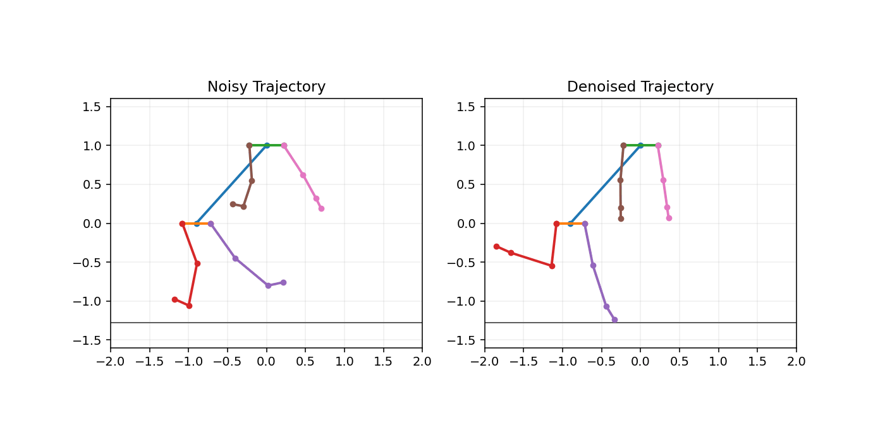

# Audio-Conditioned Humanoid Trajectory Synthesis via Diffusion Transformers

Humanoid-Motion-Diffusion is a research-grade pipeline for whole-body humanoid trajectory generation from music conditioning. The system combines SMPL/AIST++ motion data, audio feature alignment, Temporal Cross-Attention, DDPM sampling, classifier-free guidance, EMA inference, and an Automated Evaluation Framework focused on biomechanical reliability.

The project is designed around a robotics research question: can a generative model synthesize expressive full-body motion while keeping trajectories smooth, anatomically plausible, and inspectable enough for downstream Sim-to-Real validation?



## Executive Summary

The pipeline trains an audio-conditioned diffusion transformer over 24-joint SMPL axis-angle trajectories. Motion is represented as 72 channels per frame, enabling compact whole-body kinematic modeling while preserving joint-local rotations useful for robot retargeting and kinematic constraint checks.

The core engineering contribution is not only generation quality, but reliability instrumentation. Every run produces quantitative diagnostics for temporal smoothness, joint-limit violations, beat alignment, and self-collision risk. These metrics allow generated trajectories to be ranked, filtered, and audited before any robotics integration step.

Key capabilities:

- DDPM diffusion transformer over compact SMPL pose tokens. This is not a VAE latent-space diffusion model; the compact representation is the 72D SMPL kinematic pose vector.
- Temporal Cross-Attention from aligned audio features to motion tokens.
- EMA inference and classifier-free guidance for stable long-horizon generation.
- Sliding-window generation for 15-second, 450-frame showcase trajectories.
- Kinematic Constraints through biomechanical loss and post-hoc evaluation.
- Sim-to-Real Jitter Reduction via acceleration penalties, TSI monitoring, and EMA weights.
- Production Kaggle workflow with one notebook and one downloadable ZIP artifact.

## Quantitative Results

| Configuration | Sequence Length | Stabilization | TSI ↓ | JLVR ↓ | BAS ↑ | Self-Collision ↓ |
|---|---:|---|---:|---:|---:|---:|
| Baseline | 240 frames | raw checkpoint inference | 12.60 | n/a | n/a | n/a |
| Optimized | 120 frames | EMA + CFG + dense clips | 0.08 | 6.0% | 0.19 | 0.0004 |

TSI measures second-derivative motion energy and is the primary jitter indicator. The optimized configuration reduces TSI by roughly 157x relative to the baseline, moving the generated motion from unstable visual artifacts toward smooth trajectories suitable for simulation-side screening.

## Run Provenance

The reported optimized metrics come from a Kaggle CUDA run using the production profile and the generated evaluation artifacts under `outputs/kaggle/metrics/`.

| Field | Value |
|---|---|
| Config profile | `configs/kaggle_prod.yaml` |
| Evaluation source | `outputs/kaggle/metrics/evaluation_metrics.json` |
| Device | CUDA |
| Seed | `42` with deterministic PyTorch enabled |
| Epochs | `180` |
| Sequence length | `120` frames |
| Clip stride | `15` frames |
| Train / val / test clips | `4064 / 524 / 1962` |
| Train / val / test source motions with audio | `252 / 41 / 150` |
| Audio coverage | `100%` for train, validation, and test clips |
| Stability settings | AMP enabled, accumulation steps `2`, EMA decay `0.999`, conditioning dropout `0.15` |
| Failure cases | `64` at epoch 1, `0` from epoch 29 onward, `0` at epoch 180 |

Exact optimized metrics: MSE `0.0154`, TSI `0.0847`, JLVR `0.0637`, BAS `0.1967`, self-collision `0.00046`.

## System Architecture

```text
AIST++ SMPL motions       Music audio
      |                       |
      v                       v
Data curation           Beat/chroma/tempo extraction
      |                       |
      +------ aligned motion/audio windows ------+
                                                 v
                           Audio-conditioned Diffusion Transformer
                                                 |
                           DDPM + CFG + EMA + sliding-window sampling
                                                 |
                           Biomechanical evaluation and rendering
```

Core modules:

- `embodied_motion_flow/data/`: AIST++ loading, split handling, ignore-list filtering, toy data support.
- `embodied_motion_flow/audio/`: audio lookup, slicing, beat/chroma/tempo extraction, frame alignment.
- `embodied_motion_flow/models/`: Transformer denoisers and cross-attention diffusion model.
- `embodied_motion_flow/training/`: AMP, EMA, gradient accumulation, checkpointing, evaluation hooks.
- `embodied_motion_flow/evaluation/`: TSI, JLVR, BAS, self-collision and failure-case diagnostics.
- `embodied_motion_flow/pipelines/`: production showcase orchestration and artifact packaging.

## Visual Outputs

### Cinematic Showcase

[Download or open the Cinematic Showcase video](docs/assets/showcase/stardust_viral.mp4)



<video src="docs/assets/showcase/stardust_viral.mp4" controls width="720"></video>

The Viral render is a clean cinematic view of the generated humanoid motion. The MP4 includes the exact 15-second conditioning audio segment, so reviewers can inspect whether full-body dynamics follow the musical structure.

### Research Diagnostic

[Download or open the Research Diagnostic video](docs/assets/showcase/stardust_research.mp4)



<video src="docs/assets/showcase/stardust_research.mp4" controls width="920"></video>

The Research render overlays quantitative diagnostics during playback, including real-time motion quality indicators and audio-to-motion alignment panels. This is intended for model debugging, failure analysis, and research portfolio review.

### Denoising and Validation GIFs




## Known Limitations

- The system generates SMPL trajectories, not hardware-ready actuator commands.
- JLVR around `6%` is a research-stage diagnostic result, not a deployable hardware safety threshold.
- BAS is moderate; it indicates measurable beat responsiveness but not final dance-quality synchronization.
- Current evaluation does not include ground contact, center-of-mass stability, torque limits, actuator bandwidth, or robot-specific mesh collision.
- Self-collision is a fast joint-center heuristic and should be replaced by mesh-level collision checks before any deployment workflow.

## Running the Pipeline

Install the repository in editable mode:

```bash
pip install -e .
```

Prepare a local toy subset:

```bash
python scripts/utils/setup_local_data.py --max-motion-files 5
export AISTPP_ROOT="$(pwd)/data/aist_plusplus/motions"
export AISTPP_SPLIT_ROOT="$(pwd)/data/aist_plusplus/splits"
python scripts/data/download_aist_audio_official.py --csv-path data/all_music_wav_url.csv --agree-terms
```

Train and generate locally:

```bash
python run_pipeline.py train --config configs/base.yaml
python run_pipeline.py showcase --config configs/base.yaml --checkpoint outputs/checkpoints/model.pt
```

Run the production Kaggle profile:

```bash
python run_pipeline.py full \
  --config configs/kaggle_prod.yaml \
  --fresh-start \
  --zip-path /kaggle/working/embodied_motion_flow_showcase.zip
```

Or open `training_tutorial.ipynb` on Kaggle and run all cells. The notebook trains with `configs/kaggle_prod.yaml`, renders both videos, and exposes one ZIP containing metrics, plots, checkpoint, logs, manifest, and showcase media.

## Configuration Profiles

- `configs/base.yaml`: local research profile for AIST++ SMPL experiments.
- `configs/kaggle_prod.yaml`: full Kaggle profile with dense 120-frame clips, EMA/CFG inference, and 450-frame showcase generation.
- `configs/testing.yaml`: small deterministic profile for fast tests and CI-style validation.

## Documentation

- [Research Report](docs/RESEARCH_REPORT.md): evaluation engine, golden dataset mining, and biomechanical loss details.
- [Sim-to-Real Guide](docs/SIM_TO_REAL_GUIDE.md): EMA smoothing, axis-angle representation, and robotics deployment constraints.
- [Notebook Cleanup](docs/notebook_cleanup.md): rationale for keeping a single production notebook.

## Tests

```bash
pytest -q
```

The test suite covers diffusion scheduling, CFG/EMA sampling, audio alignment, AIST++ loading, biomechanical loss, evaluation metrics, failure analysis, rendering utilities, and config profile loading.
