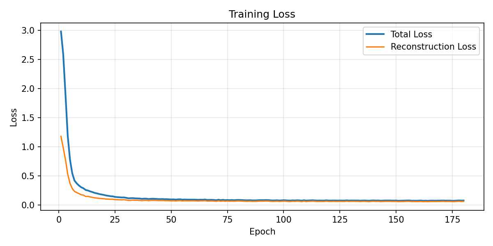
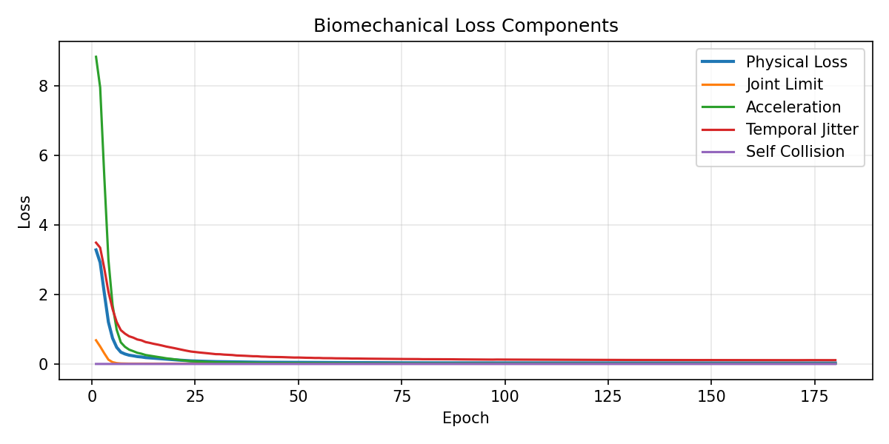

# Research Report: Evaluation Engine and Data Engineering

## Abstract

Humanoid-Motion-Diffusion studies audio-conditioned whole-body motion synthesis with a focus on measurable trajectory reliability. The model is a DDPM diffusion transformer operating in compact SMPL pose space and conditioned through Temporal Cross-Attention over aligned music features. The surrounding system is an Automated Evaluation Framework that quantifies smoothness, anatomical validity, beat alignment, and self-collision risk for every generated sequence.

The practical objective is to move beyond visual inspection. Generated trajectories must be numerically screened before they can be considered for simulation, retargeting, or downstream Sim-to-Real experiments.


## Run Provenance

The reported optimized results come from the production Kaggle profile and are traceable to the generated metrics and logs:

| Field | Value |
|---|---|
| Config profile | `configs/kaggle_prod.yaml` |
| Metrics artifact | `outputs/kaggle/metrics/evaluation_metrics.json` |
| Validation report | `outputs/kaggle/metrics/evaluation_report.csv` |
| Device | CUDA |
| Seed | `42` |
| Epochs | `180` |
| Sequence length | `120` frames |
| Clip stride | `15` frames |
| Train / val / test clips | `4064 / 524 / 1962` |
| Source motions with audio | `252 / 41 / 150` |
| Audio coverage | `100%` across train, validation, and test |
| Optimization stability | AMP, gradient accumulation `2`, warmup + cosine schedule, EMA decay `0.999`, conditioning dropout `0.15` |

Exact final metrics:

| Metric | Value |
|---|---:|
| MSE reconstruction | `0.0154` |
| Temporal Smoothness Index | `0.0847` |
| Joint Limit Violation Rate | `0.0637` |
| Beat Alignment Score | `0.1967` |
| Reference Beat Alignment Score | `0.2864` |
| Self-collision | `0.00046` |
| Physical constraint violations | `0.0256` |

## Evaluation Engine

The evaluation engine is built around batch-ready PyTorch metrics. Its role is to provide fast, reproducible signals for model selection and failure-case mining.

### Temporal Smoothness Index

Temporal Smoothness Index (TSI) measures high-frequency instability by computing second-order temporal differences over the pose trajectory. For a motion tensor `x` with shape `[B, T, D]`, TSI evaluates the L2 energy of frame-to-frame acceleration:

```text
velocity_t     = x_t - x_{t-1}
acceleration_t = velocity_t - velocity_{t-1}
TSI            = mean(||acceleration_t||_2)
```

A high TSI indicates jitter, limb snapping, or unstable denoising. This metric matters for robotics because high-frequency pose changes can exceed actuator bandwidth, induce tracking error, and produce unsafe retargeted commands.

Observed improvement:

| Model Variant | TSI ↓ | Interpretation |
|---|---:|---|
| Baseline 240-frame setup | 12.60 | Severe high-frequency instability |
| Optimized 120-frame + EMA setup | 0.08 | Smooth trajectory suitable for simulation-side screening |

The optimized model reduced TSI by approximately 157x. This was achieved through shorter dense training clips, EMA inference, stronger biomechanical regularization, and cleaner data curation.

### Training Diagnostics

The training run emits scientific plots that make convergence and physical regularization auditable.






### Joint Limit Violation Rate

Joint Limit Violation Rate (JLVR) measures how often generated axis-angle channels exceed anatomical limits. It estimates the percentage of invalid frame/joint/channel values:

```text
JLVR = count(x < lower_limit or x > upper_limit) / count(all pose channels)
```

The optimized showcase run reports:

```text
JLVR = 6.0%
```

For Sim-to-Real deployment, JLVR is a reliability proxy. The current `6.0%` level is not hardware-ready; it is a research-stage diagnostic that shows major improvement while still requiring hard filtering, retargeting constraints, or stronger joint-limit conditioning before any robot-facing pipeline.

### Beat Alignment Score

Beat Alignment Score (BAS) estimates whether motion-energy peaks correlate with musical beat events. The implementation compares local motion acceleration energy against a beat indicator derived from audio analysis.

Current optimized result:

```text
BAS = 0.19
```

This is a useful early-stage synchronization signal. BAS is not treated as a complete dance quality metric; it is a diagnostic that checks whether generated motion responds to musical structure rather than drifting independently of the conditioning signal.

### Self-Collision Metric

The self-collision diagnostic uses a kinematic heuristic over non-adjacent SMPL joints. It penalizes joint-center distances below a configurable margin. The optimized run reports:

```text
Self-Collision = 0.0004
```

The value suggests low residual interpenetration risk at the joint-center level. It does not replace mesh-level collision detection, but it is efficient enough for automated training-time monitoring and failure-case triage.

## Failure-Case Mining

The diagnostics layer identifies sequences that exceed safety thresholds and writes them to `outputs/failure_cases/` with a machine-readable reason. Typical labels include:

- Limb Explosion: extreme TSI or acceleration spikes.
- Joint Dislocation: high JLVR under anatomical limits.
- Self-Collision: non-adjacent joint centers below minimum distance.

This converts model evaluation from a manual video review process into a structured failure dataset. The same machinery can be used to create hard-negative batches for later training cycles.


## Data Curation Pipeline

The AIST++ loader is designed as a data engineering component, not a thin file reader. It performs deterministic filtering, temporal alignment, and metadata preservation before training.

### Input Data

The model uses official AIST++ SMPL motion files:

- `smpl_poses`: reshaped to `[T, 24, 3]` and flattened to 72D axis-angle pose vectors.
- `smpl_trans`: global translation used for trajectory context and physical scale checks.
- `smpl_scaling`: applied to translation and body scale-sensitive quantities when available.
- Official split files and ignore lists for reproducible train/validation/test separation.

### Golden Dataset Mining

The Golden Dataset is the subset of motion/audio windows that pass data validity and biomechanical plausibility checks. The pipeline mines it through several filters:

1. Ignore-list filtering removes sequences with poor reconstruction quality.
2. Missing-key handling skips malformed files without crashing the loader.
3. FPS alignment converts 60 FPS AIST++ data to the configured target rate, commonly 30 FPS.
4. Window extraction creates dense fixed-length clips for stable transformer training.
5. Audio coverage checks require matched music features when audio conditioning is enabled.
6. Evaluation thresholds reject or flag anatomically implausible motion windows.

This approach supports scalable data cleaning. Instead of relying on ad hoc inspection, the repository turns biomechanical metrics into dataset selection criteria.


### Golden Dataset Run Snapshot

The production run produced dense, audio-covered motion windows suitable for training and validation:

| Split | Source Motions with Audio | Motion/Audio Clips | Audio Coverage |
|---|---:|---:|---:|
| Train | `252` | `4064` | `100%` |
| Validation | `41` | `524` | `100%` |
| Test | `150` | `1962` | `100%` |

Failure-case mining provides an additional quality gate. The validation set started with `64` failing sequences at epoch 1, reached `0` failures at epoch 29, and remained at `0` failures at epoch 180. This makes the metric pipeline useful both as a model-selection signal and as a data-curation filter for future hard-negative mining.

## BiomechanicalConsistencyLoss

The training objective combines diffusion reconstruction with kinematic regularization:

```text
total_loss = reconstruction_loss + lambda_phys * physical_loss
```

The physical loss is composed of:

### Joint-Limit Penalty

This term penalizes values outside the configured SMPL axis-angle range. It discourages anatomically impossible rotations and lowers JLVR during validation.

### Acceleration Penalty

This term penalizes large second-order temporal derivatives. It is the training-time analogue of TSI and directly targets Sim-to-Real Jitter Reduction.

### Temporal Jitter Penalty

This term regularizes non-smooth frame transitions and discourages flickering in local pose channels.

### Self-Collision Loss

This term uses a distance-based heuristic between non-adjacent SMPL joint centers. It is intentionally lightweight so it can run during training without requiring a full mesh collision stack.

## Research Implications

The framework is positioned for robotics research workflows where generation quality must be auditable. The evaluation engine makes model progress measurable, and the data curation pipeline gives the training set a defensible quality boundary.

Relevant robotics engineering themes:

- DDPM diffusion transformers and denoising stability in compact SMPL pose space.
- Temporal Cross-Attention for multimodal conditioning.
- Kinematic Constraints for humanoid body plausibility.
- Automated Evaluation Framework for model selection and failure mining.
- Sim-to-Real Jitter Reduction before retargeting to physical robots.
