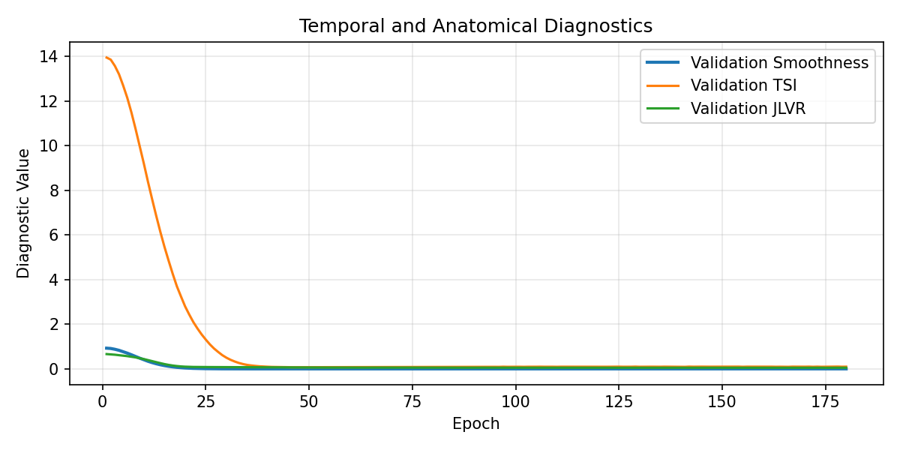

# Sim-to-Real Guide: Humanoid Motion Diffusion

## Scope

This guide explains how Humanoid-Motion-Diffusion should be interpreted in a robotics context. The repository generates SMPL-based humanoid trajectories, not direct robot actuator commands. Its value for Sim-to-Real work is in producing smooth, constrained candidate motions that can be filtered, retargeted, and validated in simulation before hardware execution.


## Why EMA Matters for Physical Actuators

Diffusion models can produce high-frequency pose noise during sampling. In videos this appears as jitter; on hardware it can become unstable tracking commands, actuator chatter, or excessive torque requests.

The pipeline uses Exponential Moving Average (EMA) weights for inference:

```text
ema_weight = decay * ema_weight + (1 - decay) * current_weight
```

EMA acts as a temporal stabilizer over training updates. It suppresses noisy checkpoint fluctuations and tends to produce smoother denoising behavior at inference time. In this project, EMA is paired with the Temporal Smoothness Index (TSI) to verify that smoothing is measurable rather than merely visual.

Observed stabilization:

| Configuration | TSI ↓ |
|---|---:|
| Baseline 240-frame setup | 12.60 |
| Optimized 120-frame + EMA setup | 0.08 |

This reduction is central to Sim-to-Real Jitter Reduction. A low TSI does not prove hardware safety, but it reduces the burden on downstream smoothing, retargeting, and controller-side filtering.



## Axis-Angle SMPL for Robotic Kinematics

The model uses 24 SMPL joints with 3 axis-angle channels each, for a 72D pose vector per frame. This representation is useful for robotics research for several reasons:

- It represents local joint rotations instead of raw 3D marker positions.
- It is compact enough for transformer-based temporal modeling.
- It preserves a kinematic tree structure compatible with retargeting pipelines.
- It supports direct anatomical range checks through Kinematic Constraints.
- It aligns with AIST++ motion capture data without requiring mesh vertices during training.

Axis-angle is not a final robot command format. A robot-specific deployment stack still needs conversion to the robot's URDF joint space, inverse kinematics, velocity limits, acceleration limits, torque limits, contact checks, and whole-body balance validation.

[Open the cinematic MP4 with audio conditioning](assets/showcase/stardust_viral.mp4)

## Recommended Sim-to-Real Pipeline

A safe robotics workflow should treat generated motion as a proposal, not an executable command:

1. Generate motion with EMA weights and classifier-free guidance.
2. Run the Automated Evaluation Framework: TSI, JLVR, BAS, self-collision.
3. Reject sequences above safety thresholds.
4. Retarget SMPL joints to the target humanoid kinematic tree.
5. Enforce robot-specific joint position, velocity, acceleration, and torque limits.
6. Validate in simulation with contact and balance constraints.
7. Apply conservative speed scaling for hardware tests.
8. Use controller-level safety filters and emergency-stop procedures.

## Metric Interpretation

### TSI

TSI is the first screening metric for actuator feasibility. High values indicate acceleration spikes and should be rejected before retargeting.

### JLVR

Joint Limit Violation Rate estimates anatomical invalidity. Current optimized result:

```text
JLVR = 6.0%
```

This is not hardware-ready. It is acceptable only as a research-stage diagnostic because it exposes residual kinematic invalidity that must be removed through hard filtering, robot-specific retargeting constraints, or stronger joint-limit conditioning before a hardware-facing pipeline.

### BAS

Beat Alignment Score measures synchronization with audio beats. Current result:

```text
BAS = 0.19
```

For robotics, BAS is not a safety metric. It is a task-performance metric for music-conditioned motion generation.

### Self-Collision

Current result:

```text
Self-Collision = 0.0004
```

This indicates low heuristic joint-center collision risk. Mesh-level collision checks are still required before deployment.

## Deployment Caveats

The current system does not model:

- ground reaction forces,
- foot contact stability,
- center-of-mass control,
- zero-moment point constraints,
- actuator torque saturation,
- thermal limits,
- latency and state-estimation noise,
- robot-specific self-collision geometry.

These gaps are expected for a trajectory synthesis research framework. They should be addressed in a retargeting and control layer, not hidden inside the generative model.

## Why the Evaluation Engine Is Deployment-Relevant

The Automated Evaluation Framework gives the research pipeline a safety-oriented quality gate. It does not certify hardware readiness, but it prevents obviously unstable generations from entering the next stage. This is the correct separation of concerns for a robotics stack:

- the generative model proposes motion,
- kinematic metrics reject bad candidates,
- simulation evaluates dynamics,
- robot-specific controllers enforce hardware constraints.

## Keywords

DDPM diffusion transformer, compact SMPL pose space, Temporal Cross-Attention, Kinematic Constraints, Sim-to-Real Jitter Reduction, Automated Evaluation Framework, EMA inference, SMPL axis-angle kinematics, humanoid trajectory synthesis.
